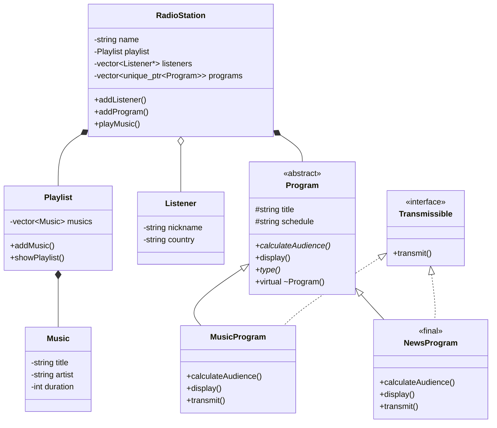

# PixelWave FM

A retro online radio system inspired by the radio stations created in Habbo Hotel private servers between 2016 and 2017. This project was developed for the **Object-Oriented Programming (OOP)** course at **Federal University of Paraíba (UFPB)** and evolved from **Practical Assignment 1 (TP1)** to **Practical Assignment 2 (TP2)**.

---

# Technologies

* C++17
* CMake
* Object-Oriented Programming
* Smart Pointers (`std::unique_ptr`)
* STL Containers (`std::vector`)

---

# Features

* Music playlist management
* Listener management
* Online radio simulation
* Automatic DJ system
* Broadcast program hierarchy
* Dynamic polymorphism
* Interface-based transmission system

---

# Project Structure

```text
pixelwave-fm/
│
├── CMakeLists.txt
├── README.md
│
└── src/
    ├── main.cpp
    │
    ├── music.hpp
    ├── music.cpp
    │
    ├── playlist.hpp
    ├── playlist.cpp
    │
    ├── listener.hpp
    ├── listener.cpp
    │
    ├── radio_station.hpp
    ├── radio_station.cpp
    │
    ├── program.hpp
    ├── program.cpp
    │
    ├── music_program.hpp
    ├── music_program.cpp
    │
    ├── news_program.hpp
    ├── news_program.cpp
    │
    └── transmissible.hpp
```

---

# Object-Oriented Concepts

### TP1

* Classes
* Encapsulation
* Composition
* Associations
* Modularization

### TP2

* Abstract Classes
* Inheritance
* Dynamic Polymorphism
* Pure Interfaces
* Virtual Destructor
* `override`
* `final`
* Multiple Interface Inheritance
* `std::unique_ptr`

---

# UML Diagram



---

# Inheritance Hierarchy

`Program` is an abstract base class that represents any type of broadcast content available on the radio station.

Concrete implementations include:

* **MusicProgram**
* **NewsProgram**

Both override the abstract behavior defined in the base class while keeping a common interface for dynamic polymorphism.

---

# Dynamic Polymorphism

Programs are stored using:

```cpp
std::vector<std::unique_ptr<Program>>
```

This allows the radio station to manipulate different program types through the same base interface while preserving each object's specific behavior.

---

# Pure Interface

The project introduces the `Transmissible` interface.

It models the capability of broadcasting content independently of the inheritance hierarchy.

Every class implementing this interface must provide:

```cpp
virtual void transmit() const = 0;
```

---

# Advanced Inheritance

`NewsProgram` is declared as **final**, preventing further specialization and preserving its intended behavior.

`MusicProgram` inherits simultaneously from:

* `Program`
* `Transmissible`

demonstrating multiple inheritance using a pure interface.

---

# Build

Using CMake:

```bash
mkdir build
cd build
cmake ..
cmake --build .
```

Manual compilation:

```bash
g++ src/*.cpp -std=c++17 -Wall -Wextra
```

---

# Author

**Vinícius Medeiros Alencar**

Federal University of Paraíba (UFPB)

Object-Oriented Programming – 2026.1